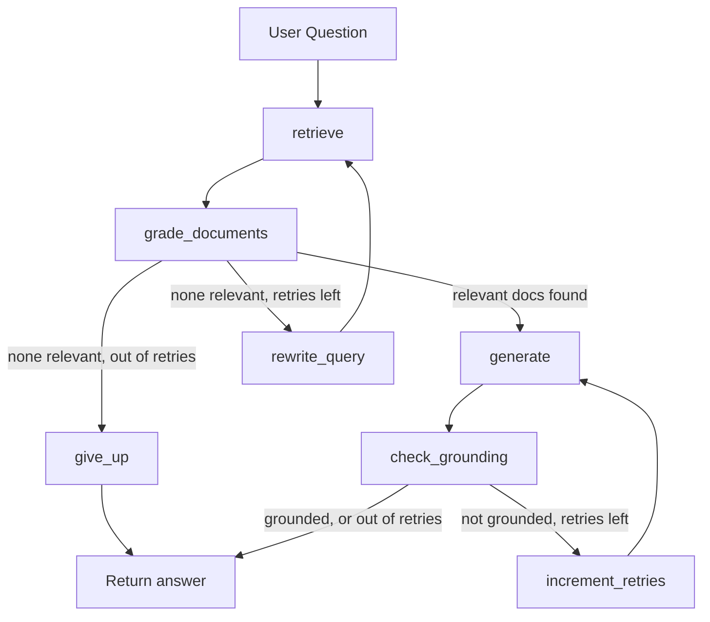

# corrective-rag-10k

Self-correcting RAG over SEC 10-K filings, built with LangGraph. Instead of a single retrieve-then-generate pass, the system grades its own retrieved documents for relevance, rewrites the query and retries when retrieval comes back empty, and checks its own answer for hallucination before returning it.


## Why

Most RAG demos stop at retrieve → generate and call it done. This project asks the harder question: how do you know it's actually working, and what happens when retrieval or generation fails?

- **Self-correction, not just generation** — a LangGraph state machine grades retrieved chunks for relevance, rewrites the query and retries when nothing relevant comes back, and runs a separate grounding check on its own answer before returning it.
- **Measured, not assumed** — a RAGAS evaluation harness compares the self-correcting graph against a naive single-pass baseline on the same test set, scoring context precision, context recall, faithfulness, and answer relevancy.
- **Built on a messy, real domain** — SEC 10-K filings are long, table-heavy, and inconsistent across companies, a harder and more realistic target than a toy Wikipedia RAG demo.

## Architecture



Retrieval is scoped per company: each ingested chunk is tagged by ticker, and a question naming "Apple" only searches Apple's chunks. Comparison questions naming multiple companies retrieve `k` chunks **per company**, not `k` shared across all of them, so one company can't crowd another out of the context.

## Results

Self-correcting graph vs. a naive single-pass baseline, same test set, same LLM and retriever:

| Metric | Baseline | Graph |
|---|---|---|
| Accuracy | 0.89 | 0.95 |
| Context precision | 0.82 | 0.86 |
| Context recall | 0.84 | 0.86 |
| Faithfulness | 0.95 | 0.95 |
| Answer relevancy | 0.84 | 0.90 |
| Abstention rate | 1.00 | 1.00 |
| Crashes | 0 | 0 |
| Avg. rewrites/question | — | 0.4 |
| Avg. retries/question | — | 0.6 |
| Avg. latency/question | 5.0s | 7.0s |

The self-correcting graph improved accuracy (0.89 → 0.95) and answer relevancy (0.84 → 0.90) over the naive baseline, and matched it on faithfulness (0.95 both) — both systems already stayed well-grounded, so the self-correction loop's main gain here is accuracy, not hallucination control. Both correctly abstained on every unanswerable question in the test set. The cost: roughly 40% higher latency per query, driven by an average of 0.4 rewrite loops and 0.6 regenerate loops per question.

*Full per-question results and RAGAS scores in `results/`.*

## Tech stack

| Layer | Choice |
|---|---|
| Orchestration | LangGraph, LangChain (LCEL) |
| LLM | Groq (`openai/gpt-oss-120b`) |
| Embeddings | Cohere (`embed-english-v3.0`) |
| Vector store | Pinecone |
| Evaluation | RAGAS + LLM-judge for exact-answer correctness |
| Source data | SEC EDGAR 10-K filings |

## Engineering highlights

- **Table-aware chunking.** Naive HTML-to-text flattening collapses financial tables into one unreadable run of numbers with no row/column labels. `ingest.py` converts each `<table>` into a row-preserving block before flattening the rest of the page, so a number stays next to its label and year.
- **Batched relevance grading.** Grading retrieved chunks one at a time costs one LLM call per chunk. Grading them together in a single call cuts that cost roughly `k`-fold, with a fail-open fallback if the response can't be parsed.
- **Retry with backoff.** Every LLM call retries with exponential backoff on a rate limit instead of failing the question outright.
- **Resumable evaluation runs.** Results are written to disk as each question completes, not just at the end — an interrupted run picks back up instead of re-spending tokens on work already done.

## Quick start

```bash
python -m venv venv
venv\Scripts\Activate      # macOS/Linux: source venv/bin/activate
pip install -r requirements.txt
```

```
# .env
GROQ_API_KEY=
GROQ_MODEL=openai/gpt-oss-120b
COHERE_API_KEY=
PINECONE_API_KEY=
PINECONE_INDEX_NAME=10k-filings
SEC_EDGAR_COMPANY_NAME=
SEC_EDGAR_EMAIL=
```

```bash
python ingest.py              # pull filings, chunk, embed, upsert to Pinecone
python app.py                 # interactive CLI
python eval.py --fresh        # full baseline-vs-graph evaluation
python debug_retrieval.py "your question" --k 5   # inspect retrieval, no LLM cost
```

## Project structure

```
corrective-rag-10k/
├── ingest.py            # pulls 10-Ks, table-aware chunking, embeds, upserts to Pinecone
├── nodes.py             # LangGraph nodes: retrieve, grade, rewrite, generate, check_grounding, give_up
├── graph.py             # wires nodes into the state machine
├── app.py               # interactive CLI
├── eval.py              # baseline vs. graph evaluation harness
├── testset.py           # hand-verified question/ground-truth set
├── debug_retrieval.py   # retrieval inspection tool
└── requirements.txt
```

## Known limitations

- Each company's ingested filing is its single most recent 10-K, which only reports ~3 comparative fiscal years — a question about an older year can fall outside that window.
- Forcing an LLM to respond via structured tool-calling isn't fully reliable across all models; some occasionally respond in plain text instead.
- Free-tier API rate limits shape how large a retrieval `k` and test set can run in one sitting.

## License

MIT
